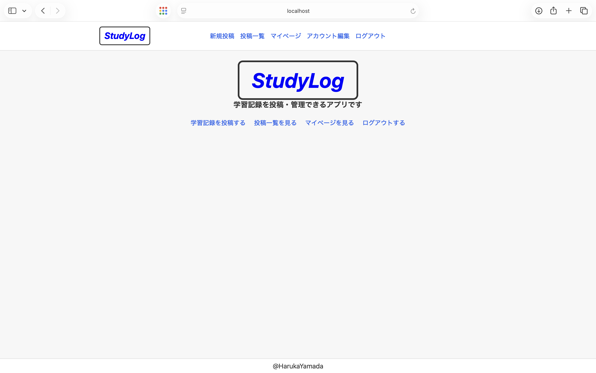
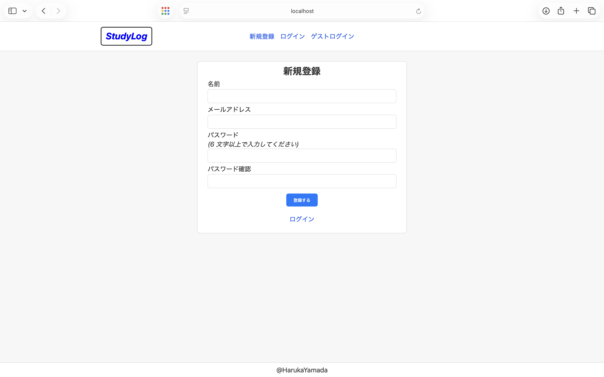
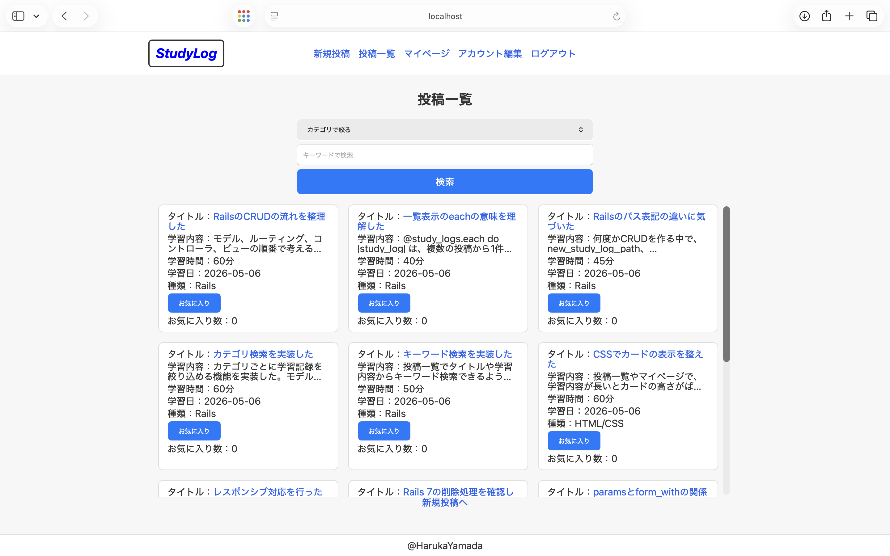
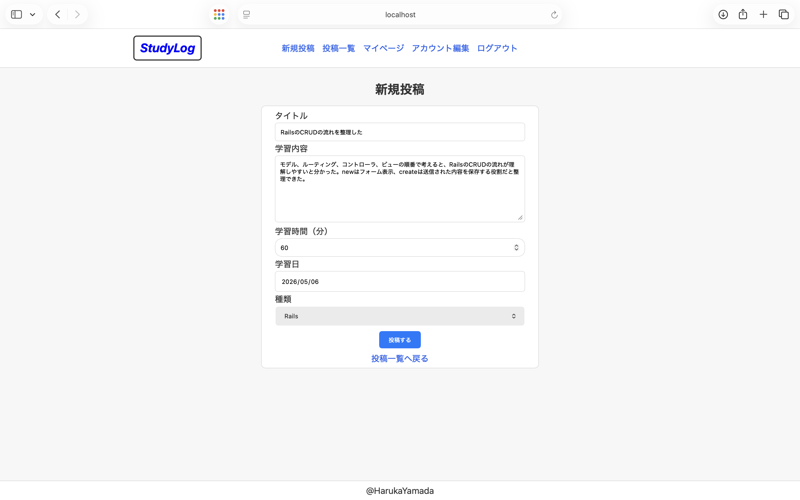
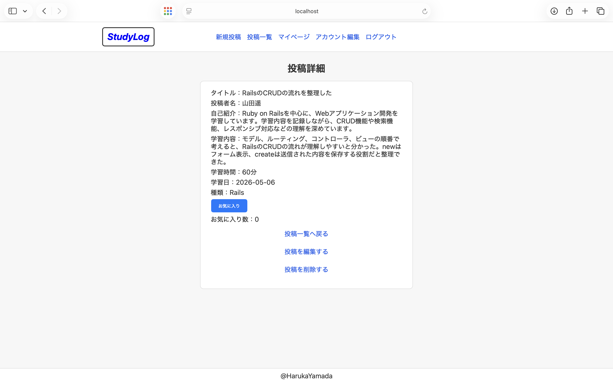
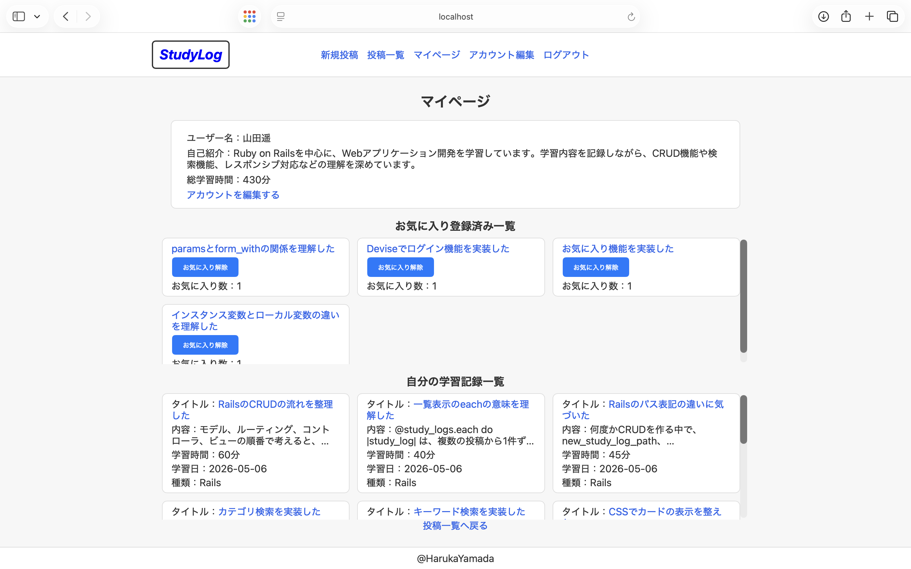
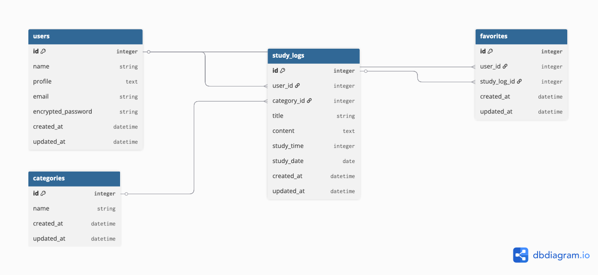

# StudyLog

## アプリの概要

StudyLogは、日々の学習内容を記録・管理できる学習記録アプリです。  
学習内容、学習時間、学習日、カテゴリを登録し、検索機能やお気に入り機能を使って、学習記録をあとから振り返ることができます。

## URL

https://portfolio-web-xtzg.onrender.com

※ Renderの無料プランを使用しているため、アクセス時に起動まで時間がかかる場合があります。

## 使用技術
- Ruby
- Ruby on Rails 7.2.2.1
- SQLite3
- Devise
- HTML / CSS
- Git / GitHub

## スクリーンショット

### トップページ

### 新規登録ページ

### 投稿一覧ページ

### 新規投稿ページ

### 投稿詳細ページ

### マイページ

## アプリの使い方

1. トップページから「新規登録する」または「ゲストログインする」を選択します。
2. ログイン後、「学習記録を投稿する」から学習内容・学習時間・学習日・カテゴリを入力して投稿します。
3. 投稿一覧では、登録された学習記録を一覧で確認できます。
4. カテゴリ検索やキーワード検索を使って、見たい学習記録を絞り込むことができます。
5. 投稿詳細ページでは、学習記録の詳細を確認できます。
6. 自分が投稿した学習記録は、詳細ページから編集・削除できます。
7. あとから見返したい学習記録は、お気に入り登録できます。
8. マイページでは、自分の学習記録一覧とお気に入り登録済みの学習記録を確認できます。

## 作成背景

プログラミング学習を進める中で、学んだ内容やエラー対応で気づいたことを、あとから見返せる場所が必要だと感じ、このアプリを作成しました。

開発を進める中で、学習記録が増えたときに「カテゴリごとに整理したい」「あとから見返したい記録を保存したい」「キーワードで探せるようにしたい」と考え、
カテゴリ検索・キーワード検索・お気に入り機能を実装しました。

単に記録を残すだけでなく、学習内容を整理し、振り返りやすくすることを意識しています。

## 工夫したところ

### 学習記録を探しやすくした点

学習記録が増えたときにも必要な内容を見返しやすいように、カテゴリ検索とキーワード検索を実装しました。  
RailsやCSSなどカテゴリごとに絞り込めるだけでなく、タイトルや学習内容からキーワードで検索できるようにしました。

### あとから見返したい記録を保存できるようにした点

学習中に重要だと感じた投稿をあとから確認できるように、お気に入り機能を実装しました。  
マイページでは、自分の学習記録一覧とお気に入り登録済みの学習記録を分けて表示し、振り返りやすい構成にしました。

### PC・スマートフォンの両方で使いやすくした点

学習中に気づいたことをすぐ記録できるよう、PCだけでなくスマートフォンでも使いやすい設計を意識しました。  
スマホでも投稿作成・一覧確認・検索・マイページ確認ができ、いつでもどこでも学習内容を記録・確認できるアプリを目指しました。

### 見やすさを意識した画面設計

フォームやカードの幅を統一し、情報を中央にまとめることで、画面全体が見やすくなるように調整しました。  
また、PCサイズの段階でレイアウトを整理していたため、レスポンシブ対応ではカードを1列にする、ヘッダーを折り返す、フォーム幅を調整することで、
スマートフォン画面にも自然に対応できました。

### 一覧表示の見やすさを改善した点

投稿一覧やマイページでは、学習内容が長くなるとカードの高さがばらついて見づらくなるため、CSSで2行まで表示し、それ以降は省略表示にしました。  
情報量を保ちつつ、一覧として見やすくなるように調整しました。

### 権限制御を意識した点

他のユーザーの投稿を勝手に編集・削除できないように、自分の投稿だけ編集・削除できるようにしました。  
投稿の詳細表示やお気に入り登録はできるようにしつつ、更新・削除の操作は投稿者本人に限定しています。

## ER図

